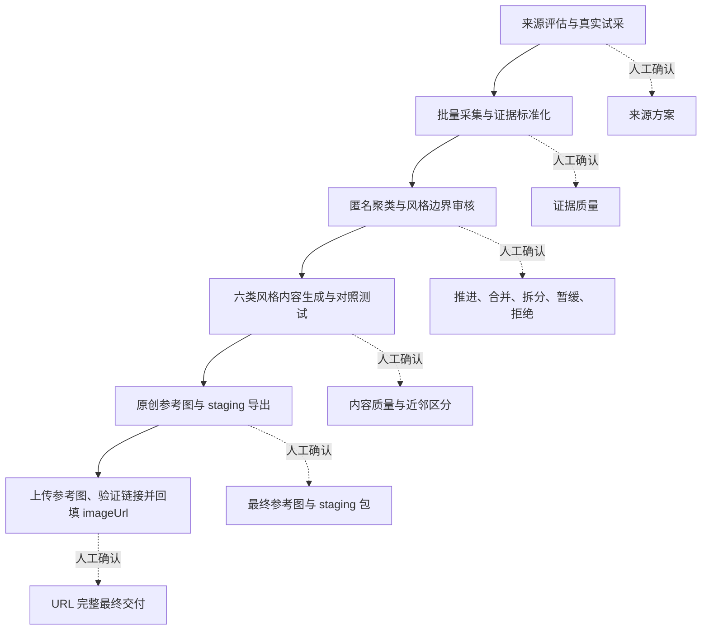

# VidMuse 风格库批量生产 Skills

这是一套面向 AI Agent 的可复用 Skill，用于把公开网站、数据集或本地视觉素材，逐步整理成 VidMuse 后台风格库标准风格记录。

覆盖完整生产流程：

```text
理解素材来源
→ 采集并整理证据
→ 聚类和判断风格边界
→ 与现有官方库查重
→ 生成标准风格内容
→ 生成一张原创参考图
→ 导出 JSON / CSV
→ 上传最终参考图并回填、验证 imageUrl
```

参考图交付获批后进入正式第六阶段：把每条风格唯一的最终参考图上传到 VidMuse dev 项目，验证可公开访问的 HTTPS 链接，并在独立目录中回填 `imageUrl`。流程不创建后台风格，也不写入线上后台。

## 风格定义

风格定义为：

> 以一个可识别的文化或创作锚点为核心，能够跨多个可比内容保持一致，并能被用户识别、被推荐系统检索、被生成模型执行的视觉配方。

### 1. 锚点（Anchor）

锚点是风格名称和公共认知的来源，例如：

- 导演、摄影师、艺术家、设计师；
- 一部风格统一的电影、动画、游戏或音乐视频；
- 工作室、艺术运动、建筑流派；
- Dreamcore、Poolcore 等已有公共含义的社区审美；
- Risograph、Claymation、MiniDV 等具有稳定视觉规律的媒介或技法。

`Romantic`、`Cinematic`、`Soft Light` 只是宽泛描述，不是足够明确的锚点。

### 2. 稳定视觉语法

有名称不代表一定能形成风格。素材必须证明它存在一组共同出现的视觉规律，例如：

- 色彩和明暗如何组织；
- 线条、笔触、形体或模型如何形成；
- 构图、空间、比例和透视如何安排；
- 材质、颗粒、印刷、渲染或后期如何呈现；
- 在有连续证据时，运动、节奏或剪辑如何构成风格。

这些规律应在风格的适用范围内跨多个内容成立，不能只来自某个角色、地点、道具或名场面。

### 3. 风格边界

两个名称不同，不代表一定是两种风格。只有当它们会导致不同的用户选择和不同的生成结果时，才值得同时保留。

完整标准见：

- [风格定义与聚类规则](docs/style-clustering-rules.zh-CN.md)
- [风格内容规范](docs/style-library-field-standard.zh-CN.md)
- [机器校验参考](docs/style-library-field-technical-reference.zh-CN.md)

## 最终会得到什么

每条通过审核的风格包含六类信息：

| 内容 | 作用 |
|---|---|
| 用户可见风格名称（`name`） | 告诉用户“这是什么风格”，同时提供稳定、可理解的锚点身份 |
| 有序视觉指纹（`tags`） | 用少量短词先标记视觉形态、风格家族和最关键差异，供全库检索，并置于生成提示的高优先级位置 |
| 选择与推荐说明（`description`） | 解释适合什么项目、音乐情绪和用户意图，以及为什么它和相邻风格不同 |
| 完整视觉机制（`analysis`） | 说明风格如何形成、如何迁移到不同内容，以及哪些变化仍属于该风格 |
| 可执行风格壳（`promptSample`） | 把完整规律压缩为可直接参与生成的风格配方，只说明“怎样呈现”，不规定“画什么” |
| 参考图地址（`imageUrl`） | 指向最终展示给用户的一张原创参考图；第五阶段 staging 交付保持为空，第六阶段写入独立验证通过的 HTTPS 地址 |

最终目录包含：

- 风格 JSON 和 CSV；
- 每条风格一张最终原创参考图；
- 参考图生成提示和对应清单；
- Planner 原始 URL 映射、标准化映射和外部网络校验报告；
- 原始证据、去重结果、聚类边界和审核记录；
- 可恢复的运行清单和各阶段批准记录。

## 四个 Skill 分别做什么

### `vidmuse-style-pipeline`

总控入口。负责建立一次运行、管理六个阶段、冻结已确认结果、恢复中断任务，以及防止后续重跑覆盖人工决定。

它本身不重复实现采集、聚类和写作，而是调用下面三个阶段 Skill。

### `vidmuse-style-source-mining`

负责理解来源、试采、批量采集、下载校验、去重和证据标准化。

它会把来源数据拆成三类：

- 画面中可观察、可参与聚类的视觉特征；
- 人物、物体、地点、剧情等内容特征；
- 创作者、作品、来源链接、查询关系等溯源信息。

来源名称和查询标签不能直接充当风格事实。

### `vidmuse-style-concept-curation`

负责从证据中形成匿名视觉簇，再恢复锚点信息，判断哪些候选应推进、合并、拆分、暂缓或拒绝。

它还负责在候选进入内容生产前查询实时官方风格库，完成名称、别名、父子关系和高相似风格查重。

### `vidmuse-style-record-production`

负责把已确认的风格概念转成六类正式内容，进行近邻生成对照，生成一张原创参考图与 staging JSON / CSV；参考图交付获批后，再把最终图上传到 dev 项目、验证可点击链接，并在第六阶段目录中形成 `imageUrl` 完整的最终 JSON / CSV。

它必须读取完整内容规范，不能只凭 Skill 摘要或锚点名称自由发挥。

## 工作流程



## SOP：从新来源批量生产风格

### 阶段 1：理解来源并完成试采

先确认：

- 来源中有哪些可发现的创作者、作品、流派或技法；
- 搜索、详情、分页、下载和恢复路径是否可靠；
- 一条“独立证据”应如何定义；
- 哪些元数据可信，哪些只是来源标签或推断；
- 来源能提供静态外观、连续运动、剪辑结构或哪些其他证据；
- 如何去重，如何保留上下文和溯源；
- 采集规模、采样分层和停止条件是什么。

先抓取一个真实小样本。只有当下载、恢复、标准化和证据质量都可行时，才放大采集。

#### 官方库在此阶段的作用

第一轮确认前会使用cli查询所选环境的实时官方风格库，汇报当前可见构成和明显缺口。

这份结果只作为背景，不得改变本来源的采集范围、采集优先级、采样分层或停止条件。

人工确认：来源方案和真实小样本是否足以支持批量采集。

### 阶段 2：建立可追溯证据库

批量采集后，Skill 会：

1. 保存原始清单和本地素材；
2. 校验文件完整性；
3. 合并重复发现关系；
4. 区分独立证据、同一上下文和同一来源组；
5. 分离视觉特征、内容特征和溯源信息；
6. 隔离损坏、缺失、不可访问或含义不清的记录；
7. 生成数据质量报告和可视化联系表。

人工确认：证据是否足够清晰、独立、可追溯，并覆盖来源中的主要变化。

### 阶段 3：形成并审核风格概念

这一阶段先隐藏创作者、作品名和查询标签，只依据画面建立匿名候选，减少“看到名人就假定有风格”的偏差。

随后恢复溯源信息，为候选选择合适的锚点层级，并检查：

- 核心视觉规律；
- 允许变化的范围；
- 应排除的角色、剧情、地点和来源母题；
- 与最近邻候选的可见差异；
- 父级和叶子级风格是否都有独立证据；
- 与实时官方风格库是否重复或高度相似。

AI 会先给出推进、合并、拆分、暂缓或拒绝建议。人工检查整批结果，只需修改例外，不要求逐条重新填写审核表。

审核报告还会汇总候选的视觉形态和锚点构成，并给出非约束性的推荐推进比例。比例只辅助人工平衡质量和覆盖，不能自动淘汰成立的风格。

人工确认：哪些风格概念可以进入正式内容生产。

### 阶段 4：生成正式风格内容

每条风格必须从已审核证据推导，不能只输入一个名字让模型自由发挥。

推荐推导顺序：

1. 先确定用户可见名称，锁定正确的锚点层级；
2. 写完整视觉机制，明确证据支持的核心规律、允许变化和边界；
3. 从完整机制中提炼有序视觉指纹；
4. 根据用户选择场景写推荐说明；
5. 把每次生成都应执行的规律压缩成风格壳。

质量要求：

- 视觉指纹应从大类到核心差异排列，短而清楚；
- 推荐说明解释适用项目和相邻边界，不堆生成词；
- 完整机制按实际媒介分析，不强迫绘画、建筑或 3D 使用摄影模板；
- 风格壳只描述呈现方式，不带入具体角色、剧情、名场面或来源路径；
- 不包含模型名称、质量灌水、权重语法、分辨率、画幅或负向命令；
- 内容依赖型风格可以保留成立所必需的通用母题。

人工确认：只看名称和视觉指纹能否正确检索；阅读推荐说明后能否正确选择；执行完整机制和风格壳后能否稳定生成。

### 阶段 5：生成参考图并导出

参考图不是从研究素材中挑一张，也不是人工逐条临时编写提示。

Skill 使用统一的参考图提示编译流程：

1. 读取已确认的风格规律；
2. 根据媒介和适用范围自动选择中性原创内容；
3. 组合视觉指纹、内容和风格壳；
4. 确保一张图能展示至少数个最高优先级规律；
5. 自动生成并校检；
6. 失败时替换，而不是在最终交付中累计多张候选。

每条风格最终只保留一张原创参考图。导出时图片地址保持为空，供后续上传后回填。

人工确认：参考图是否一眼体现目标风格、与相邻风格可分、无水印和文字污染。

## 不同素材类型如何适配

| 素材类型 | 重点观察 |
|---|---|
| 真人影像 | 镜头与成像、曝光、光线、空间、光学和后期 |
| 摄影 | 摄影过程、构图、色调、光线、表面处理 |
| 绘画与绘图 | 笔触、线条、形体、颜料或纸面、画面空间 |
| 2D 插画与动画 | 线条、形变、色彩、平面层次、动画表现 |
| 3D 与游戏画面 | 建模、比例、材质、渲染、空间组织 |
| 平面设计 | 版式、图形、文字关系、色彩、印刷或数字表面 |
| 建筑与空间 | 体量、几何、材料、尺度、空间秩序 |
| 混合媒介 | 图层、媒介边缘、合成方式、材质关系 |
| 连续视频 | 在保留顺序和上下文时，可补充运动、节奏、转场和剪辑规律 |

## 安装

### 前置条件

- Python 3.10 或更高版本；
- Codex 或其他支持目录型 Skills 的 Agent；
- `jsonschema` 与 `Pillow`；
- 如需实时查询官方风格库，需要已安装并登录 VidMuse CLI。

安装 Python 依赖：

```powershell
python -m pip install -r requirements.txt
```

### 安装到 Codex

将四个目录复制到 Codex Skills 目录。

PowerShell：

```powershell
$target = Join-Path $HOME ".codex\skills"
New-Item -ItemType Directory -Path $target -Force | Out-Null
Get-ChildItem .\skills -Directory -Filter "vidmuse-style-*" |
  ForEach-Object { Copy-Item $_.FullName $target -Recurse -Force }
```

macOS / Linux：

```bash
mkdir -p ~/.codex/skills
cp -R skills/vidmuse-style-* ~/.codex/skills/
```

重新启动或刷新 Agent 会话，让它重新发现 Skills。

### 验证安装包

```powershell
python skills/vidmuse-style-pipeline/scripts/verify_standards.py check
python skills/vidmuse-style-pipeline/scripts/validate_localizations.py --skills-root skills
python -m unittest discover -s tests -p "test_*.py"
```

## 推荐使用方式

最简单的方式是在 Agent 中直接提出任务：

```text
请使用 vidmuse-style-pipeline，从以下来源建立一批 VidMuse 风格候选：
<来源 URL 或本地素材目录>

本次使用 dev 官方风格库做实时查重。
先完成来源评估和真实小样本，不要直接放量。
每个阶段产出审核包并等待我确认；最终输出本地 JSON、CSV 和每条风格一张原创参考图，不上传后台。
```

若只需要某个阶段，可以直接调用对应 Skill：

```text
请使用 vidmuse-style-source-mining，把这个艺术作品数据集整理成标准证据库。
```

```text
请使用 vidmuse-style-concept-curation，对这批已确认的证据进行匿名聚类、风格边界审核和官方库查重。
```

```text
请使用 vidmuse-style-record-production，把这些已确认的风格概念生成正式内容和原创参考图。
```

## 使用总控脚本管理长任务

总控脚本管理阶段状态、人工确认和断点恢复；它不会脱离 Agent 自动抓取网站或替你做视觉判断。

初始化一次运行：

```powershell
python skills/vidmuse-style-pipeline/scripts/run_pipeline.py init `
  runs/art-source-001 `
  --name "Art source batch 001" `
  --source "https://example.com/archive"
```

开始某个阶段：

```powershell
python skills/vidmuse-style-pipeline/scripts/run_pipeline.py start `
  runs/art-source-001 `
  --stage source-plan `
  --worker "codex"
```

审核通过：

```powershell
python skills/vidmuse-style-pipeline/scripts/run_pipeline.py approve `
  runs/art-source-001 `
  --stage source-plan `
  --reviewer "your-name" `
  --note "来源结构、试采和恢复路径已确认"
```

查看状态：

```powershell
python skills/vidmuse-style-pipeline/scripts/run_pipeline.py status runs/art-source-001
```

需要修改已批准的上游阶段时，使用 `reopen`。系统会保留原有素材和审核记录，并将受影响的下游阶段标记为过期。

六个阶段依次为：

1. `source-plan`：来源方案与试采；
2. `evidence`：证据库；
3. `concept`：风格概念和边界；
4. `records`：正式内容；
5. `preview-export`：参考图与 staging 导出；
6. `url-backfill`：上传已批准参考图、验证链接并回填 `imageUrl`。

## 官方风格库查询

默认查询 dev：

```powershell
python skills/vidmuse-style-concept-curation/scripts/snapshot_official_catalog.py `
  --environment dev `
  --output official-style-catalog.json
```

查询 prod：

```powershell
python skills/vidmuse-style-concept-curation/scripts/snapshot_official_catalog.py `
  --environment prod `
  --output official-style-catalog.json
```

脚本会验证配置地址与请求环境一致，防止环境标签和实际查询目标不一致。风格数量是每次查询的动态结果，不是规范中的固定值。

## 常见问题

### 为什么不能直接按创作者或作品名分组

一个创作者的不同时期、作品和媒介可能差异很大。名称只提供待验证范围，最终仍需由视觉一致性、边界和生成结果决定。

### 为什么先匿名聚类，再恢复名称

这样可以减少名气、作品标签和查询词对视觉判断的干扰。匿名聚类负责发现规律，锚点负责解释和命名。

### 现有官方库缺少某类风格，是否应优先抓这一类

不应自动这样做。官方库构成可以在阶段汇报中提示问题，但采集方案应由当前来源能提供什么决定。聚类后可以给出候选构成建议，再由人工选择推进比例。

### 研究素材能否直接成为用户参考图

默认不能。研究素材用于证明和抽象规律；最终参考图使用原创内容生成，并单独检查水印、文字、版权角色和名场面复刻。

### 一个候选和官方风格很像怎么办

先判断它是否会改变用户选择和生成结果。若只是别名或高相似配方，应合并或保留现有风格；若证据证明它是明确不同的叶子风格，可以继续推进。

## 仓库结构

```text
.
├── README.md
├── requirements.txt
├── docs/
│   ├── style-clustering-rules.zh-CN.md
│   ├── style-library-field-standard.zh-CN.md
│   └── style-library-field-technical-reference.zh-CN.md
├── skills/
│   ├── vidmuse-style-pipeline/
│   ├── vidmuse-style-source-mining/
│   ├── vidmuse-style-concept-curation/
│   └── vidmuse-style-record-production/
└── tests/
    └── test_skill_suite.py
```

英文 `SKILL.md` 是 Agent 执行版本；同目录下的 `SKILL.zh-CN.md` 用于中文审核。修改时先更新英文执行版，再同步中文镜像和来源哈希。
